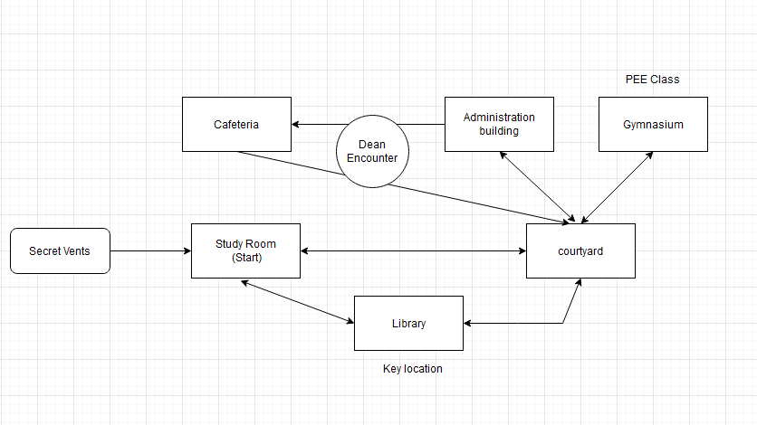

Rooms to code:
Study Room
Secret Vent exit
Library
    - Key location
        - search bookshelves
        - open spanish 101 book
        - inside is a key, take the key
Courtyard
    - central location to get to rest of campus
Gymnasium
    - build required strength to open cafeteria door
        - take PEE class
            - Teachers teaching to teach, couches coaching to coach montage
Administration building
    - defeat Dean boss
        - perform karaoke
        - buy an oculus rift
Cafeteria
    - If Dean has not been defeated he will intercept you on the way
    - Win condition
        - required to open door to cafeteria:
            Strength (gymnasium)
            key (library)
            Defeat Dean

